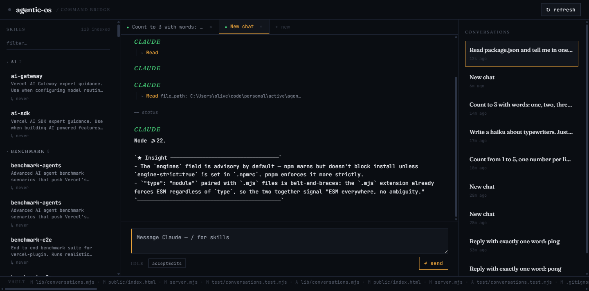

# Agentic OS

A custom web client for [Claude Code](https://claude.com/claude-code). Multi-turn chat, persistent conversations, every installed skill at your fingertips — running locally on your machine, talking to your own Claude CLI.



## Why

Claude Code in the terminal is excellent. But a terminal isn't always the best surface — sometimes you want tabs, a clickable skill picker, persistent conversations you can come back to a day later, and a UI you can hand to a friend who's never used a CLI.

Agentic OS is that surface. It spawns the same `claude` CLI you already have installed, talks to it over its `stream-json` protocol, and renders everything in the browser. No new model. No new auth. No SaaS.

## What's in the box

- **Multi-turn chat** with token-by-token streaming — feels like the real thing because it *is* the real thing.
- **Tabs + persistent conversations** — every chat is saved as JSONL on disk under `data/projects/<hash>/conversations/`. Refresh the page, your chat is still there. Resumable across server restarts via `claude --resume`.
- **Per-project workspaces** — click the wordmark in the top-left to switch projects. Each project gets its own conversation history, skill scope, and vault-changes feed.
- **Skill + file autocomplete** — type `/` to fuzzy-search every skill installed in `~/.claude/skills` and across your installed plugins (175+ in a typical setup). Type `@` to fuzzy-search files in the active project. Tab to insert. Claude reads `@path` mentions natively.
- **Permission chip** — every conversation has a permission mode (`acceptEdits` by default, `bypassPermissions`, or `plan`). Click to cycle. Mode is persisted per chat and forwarded to the CLI.
- **Vault changes ticker** — bottom bar shows `git log` activity in your project from the last 24h, so you can see what Claude did at a glance.
- **Real Claude usage stats** in the topbar (5h + weekly percentage), sourced from the local stats cache.

## Quickstart

**Prerequisites:**
- Node.js ≥ 22
- [Claude Code](https://docs.claude.com/en/docs/claude-code/quickstart) installed and authenticated (run `claude --version` to verify)

**Run it:**

```bash
git clone https://github.com/oliversignorini/ai-os.git
cd ai-os
npm start
```

Open <http://localhost:3737>. The first project is whatever directory you ran `npm start` in — switch via the wordmark to point at any other project on your machine.

No `npm install` — there are zero runtime dependencies. Just Node 22's standard library.

**Custom port / project:**

```bash
PORT=4000 node server.mjs --project /path/to/your/project
```

## How it works

```
┌──────────────────┐    HTTP/SSE    ┌──────────────────┐    spawn + JSONL    ┌──────────────┐
│  Browser (UI)    │ ◄────────────► │  Node server     │ ◄─────────────────► │  claude CLI  │
│  vanilla JS +    │                │  (~700 LOC)      │                     │  (yours)     │
│  Tailwind CDN    │                │                  │                     │              │
└──────────────────┘                └──────────────────┘                     └──────────────┘
                                            │
                                            ▼
                                    data/projects/<hash>/
                                    conversations/<id>.jsonl
```

- **Server** (`server.mjs`): single-file HTTP + SSE server. Spawns `claude -p --input-format stream-json --output-format stream-json --include-partial-messages --replay-user-messages --session-id <uuid> --permission-mode <mode>` per active conversation. Long-lived child for instant turn-around; respawns with `--resume` if the child has exited.
- **Persistence**: every chat event is appended to a per-conversation JSONL file. Conversations index in `data/projects/<hash>/conversations/index.jsonl`. The `<hash>` is derived from the absolute project path so different projects can't accidentally see each other's history.
- **Frontend** (`public/index.html`): single HTML file, vanilla JS, Tailwind via CDN. Three panes: skills (left), chat (center), conversations (right). All state in DOM + localStorage. No build step.

## Honest scope (what this is and isn't)

**This is:** a personal-use dev tool for someone who has Claude Code installed and wants a nicer client for it. A starting point you can fork. Real, working software.

**This isn't:**
- A hosted service. There's no SaaS. You run it on your own machine against your own auth.
- A multi-user app. Permissions assume one human at the keyboard.
- Production-ready. No HTTPS, no rate limiting, no audit log. If you expose this to the internet you'll have a bad time.
- A replacement for the Claude Code CLI. The CLI still does things this UI doesn't (raw shell access, configuration, etc.). This is a complementary surface.

## Config + storage

- **`data/config.json`** — last-used project, claude binary path, recent projects list. Auto-created.
- **`data/projects/<hash>/conversations/`** — per-project chat history (gitignored).
- **`~/.claude/`** — your existing Claude Code state. We read skills + plugin scans + the stats cache from here. We don't write to it.

## Development

```bash
npm test    # Run the test suite (node --test, no extra deps)
npm start   # Boot the server
```

Tests live in `test/*.test.mjs`. There are 65 of them covering the skill scanner, plugin dedup, project switcher, conversation lifecycle, permission modes, file search, and SSE streaming. Run them before sending a PR.

## License

MIT. Use it, fork it, sell it, build a SaaS out of it. If you do something interesting, [tell me](https://github.com/oliversignorini).
